# Parking Spot Detector and Classifier

## Overview

A classical image processing system that automatically detects and classifies parking spots as occupied or empty. The system uses edge detection, morphological operations, and grid line analysis to identify parking spaces, then applies intensity and texture-based features to determine occupancy status.

## Steps to Run

1. Install required dependencies:
```bash
python3 -m venv venv
source /venv/bin/activate
pip install -r requirements.txt
```

2. Organize your parking lot images in the following structure:
```
sets/
├── easy/
├── medium/
└── hard/
```

3. Run the notebook using Jupyter/VS Code

## Pipeline
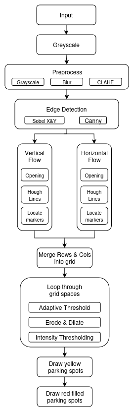
1. **Preprocessing**: 
   - Converts input images to grayscale
   - Applies Gaussian blur (5×5 kernel) for noise reduction
   - Enhances contrast using CLAHE with 8×8 tile grid

2. **Edge Detection**: 
   - Computes Sobel gradients in X and Y directions
   - Calculates gradient magnitude for edge strength
   - Applies Canny edge detector (thresholds: 30-100)

3. **Grid Formation**: 
   - Extracts horizontal lines using morphological opening (40×1 kernel)
   - Extracts vertical lines using morphological opening (1×40 kernel)
   - Applies probabilistic Hough transform to detect line segments
   - Uses Gaussian smoothing and peak detection to locate row/column markers

4. **Slot Detection**: 
   - Merges row and column markers into a grid structure
   - Filters grid cells based on size constraints
   - Generates bounding boxes for individual parking spaces

5. **Classification**: 
   - Extracts multiple features per slot:
     - Mean intensity and standard deviation
     - Edge density from Canny detection
     - Dark/bright pixel ratios
     - Local texture variance
   - Computes occupancy score based on weighted features
   - Classifies as occupied if score ≥ 2

6. **Visualization**: 
   - Draws yellow boxes around all detected parking spots
   - Adds red inner boxes for occupied spaces
   - Marks corner points with red circles

## Output

### Easy Difficulty
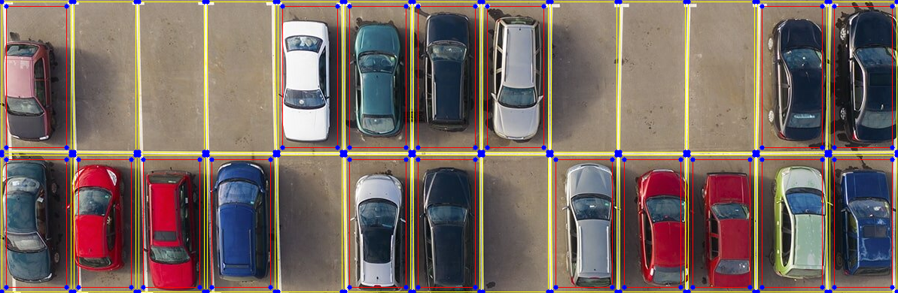
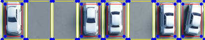
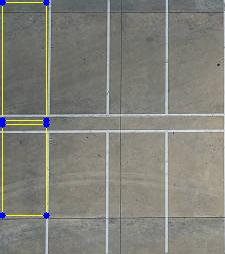
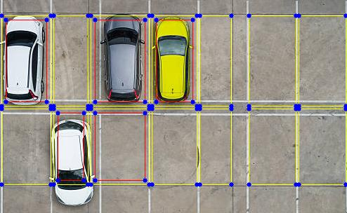

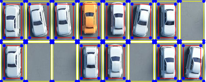
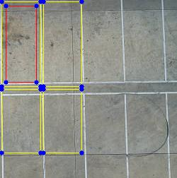

### Medium Difficulty
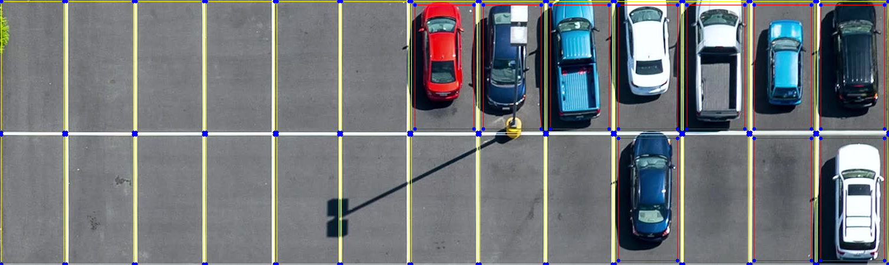
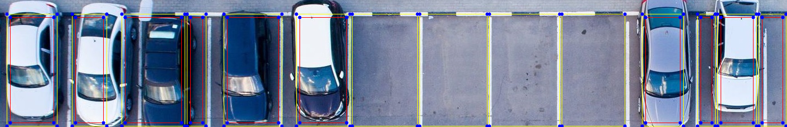
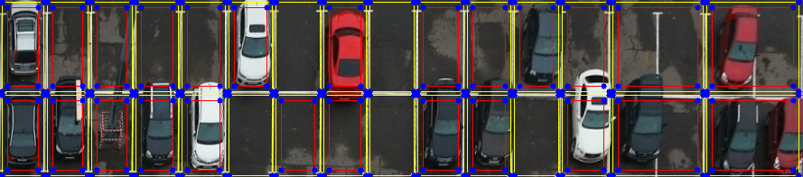

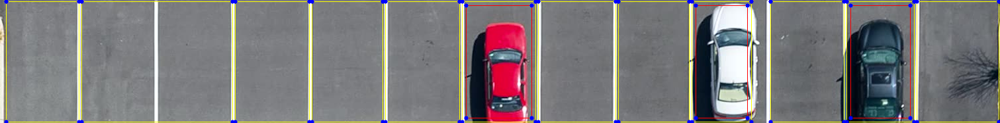
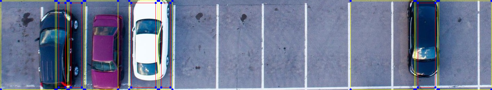

### Hard Difficulty
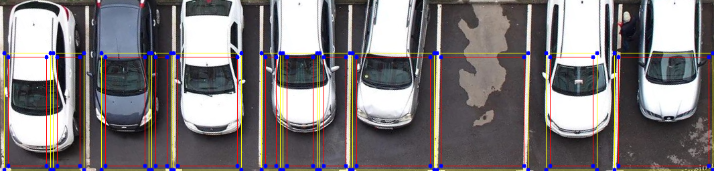
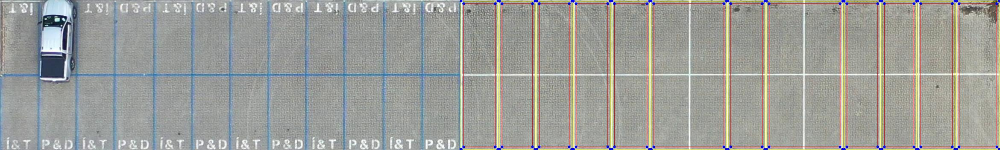
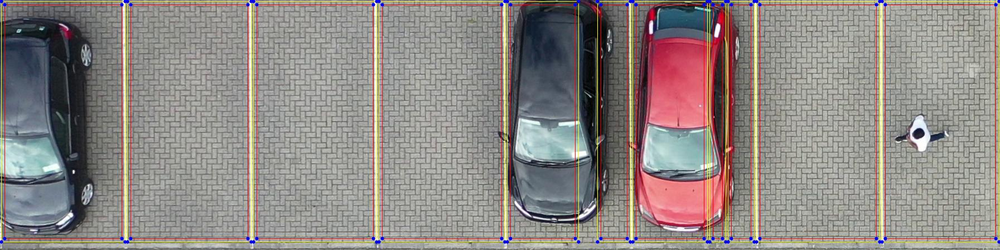

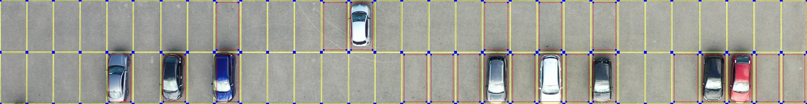
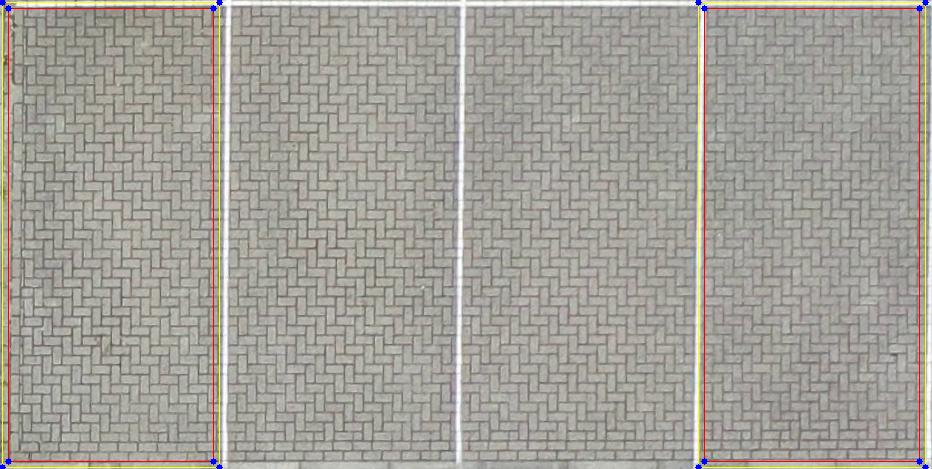

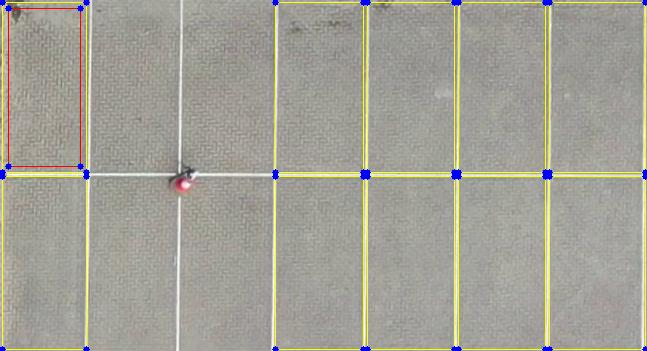
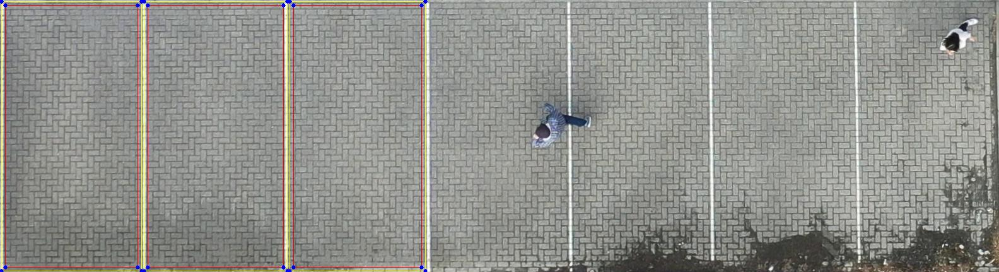

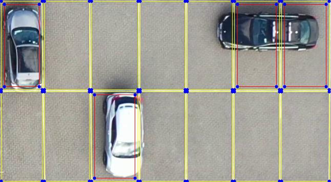

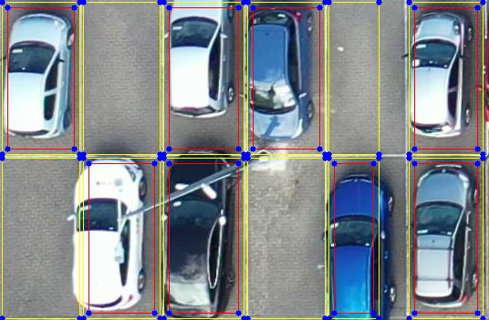

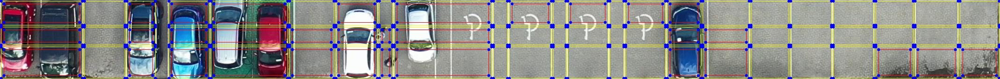

---

**Author**: Tanush Rajkumar  
